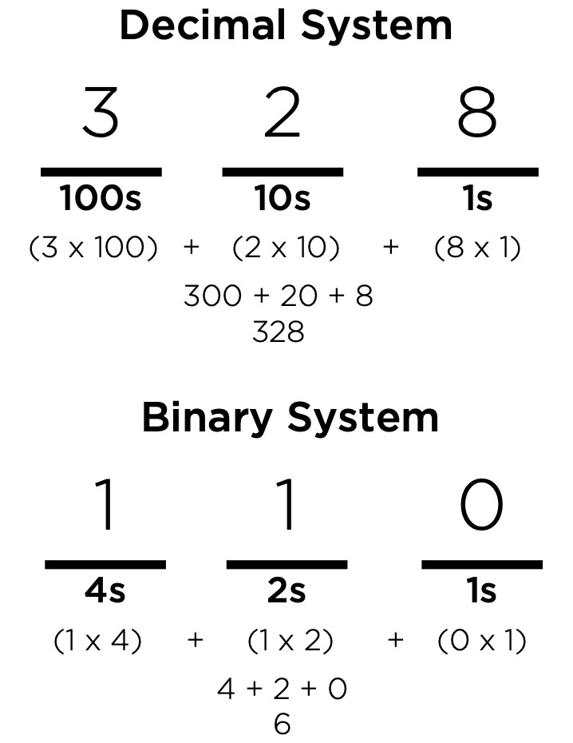

# Binary

In this lab you will learn:

- What is binary?
- How do we convert binary to decimal and vice versa

## Overview

Computers represent data in the form of bits, which are just values that can be either 0 and 1. In order to perform mathematical calculations with bits, computers use a number system called **binary**, which is a number system which only uses two digits: 0 and 1.



## Number Systems

Every number system has a **base**, which refers to the number of possible values each digit can take. Most people are used to the **decimal** number system, also known as the base 10 system, where digits can be any value from 0 to 9. In the decimal system, each digit in a number represents a power of 10. The rightmost digit represents the 1s place (which is 100). The digit second from the right is the 10s place (or 101). The next digit over is the 100s place (or 102). To compute the value of a number, just multiply the digit in each place by the value of the place, and add the numbers together.
Binary is a number system with base 2, where digits can only be
0 to 1. In this system, each place value in a number represents a
0 power of 2. The rightmost digit is still the 1s place (which is 2 ). 

The next digit over is the 2s place (equal to 21). The next digit over is the 4s place (equal to 22), and it would continue on: with the 8s place, the 16s place, the 32s place, etc. To compute the value of a binary number, just multiply the digit in each place (either 1 or 0) by the value of the place, and add the numbers together. So **110** becomes **1x4 + 1x2 + 0x1 = 4 + 2 + 0 = 6**.



## Counting in Binary

Counting in binary is much like counting in decimal, with the restriction that we’re only allowed to use two digits: 0 and 1. So 0 translated to binary is still 0, and 1 translated to binary is still 1. But since binary doesn’t allow the digit 2, in order to represent 2 in binary we need another binary digit. Thus, the number 10 can be used to represent 2. Since there is a 1 in the 2s place, and a 0 in the 1s place, the value of the number is2x1 + 0x1 = 2. If2in binary is 10, then 3 in binary is 11.
However, to represent the number 4, we’ve once again run out of bits. In order to represent the number, a third bit is required, to create a value in the 4s place. 100 therefore is the binary repre- sentation of the number 4.
Mathematics that can be performed in the decimal system can also be performed in binary. Binary numbers can be counted, added, subtracted, multiplied, and divided just like numbers in decimal, and thus can be used by computers in order to execute computations and make calculations.



## Your Turn!

To the right, write a program that takes a binary number as input and prints out that number in decimal notation. HINT: Try converting a few examples by hand, before fomulating the process more formally in C code.

```c
Please enter a binary number: 101101
The decimal number of 101101 is 45
```



### Style, Check, & Submit

At this point you should no longer need me to point out how these tools work.  Make sure to check your style using `style50 binary.c`!  Here is the slug you will need for both `check50` and `submit50`:

```
canisiushs/problems/2021/binary
```

Congratulations, you've completed the Binary Lab!

[Download our CS50 Reference sheet on Binary](https://cs50.harvard.edu/ap/2021/curriculum/x/references/binary.pdf)
